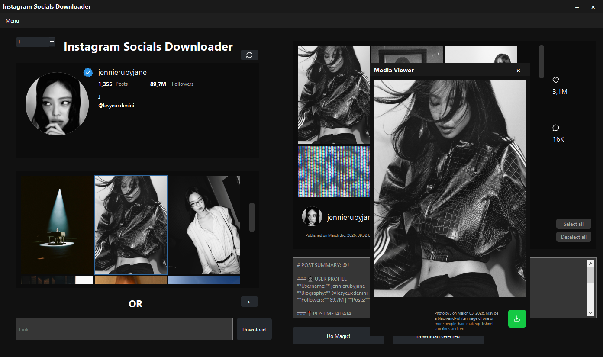

# Instagram Socials Downloader

<p align="center">
  
</p>

<p align="center">
   A powerful Instagram media downloader built with C++ and the Qt Framework. This tool allows users to browse Instagram profiles, view feeds, and download high-quality images and videos with ease.
</p>

## Features

- **Profile Management**: Bookmark your favorite Instagram profiles for quick access.
- **Feed & Story Support**: Browse through user feeds and view the latest stories.
- **Media Downloader**: Download images and videos directly to your local machine.
- **Custom Templates**: Generate custom captions for your downloads using a flexible placeholder system (e.g., `{user}`, `{caption}`, `{link}`).
- **Multi-Language Support**: Available in multiple languages, including English, German, French, Spanish, Danish, Dutch, Portuguese, Italian, Chinese, Japanese, Korean, and Thai.

## Preview



---

## Getting Started

1. Download the latest `.exe` installer from [Releases](https://github.com/rhewrani/Instagram-Socials-Downloader/releases)
2. Run the installer (Windows only)
3. Launch **Instagram Socials Downloader** from your Start Menu or desktop

> 💻 **Platform**: Windows 10/11 (64-bit)  
> 🌐 **Internet connection required**


### Building From Source

#### Prerequisites

*   C++ compiler (e.g., MSVC 2019/2022 for Windows)
*   Qt 6.x
*   CMake (version 3.16 or higher)

#### Steps

1.  Clone the repository:
    ```bash
    git clone https://github.com/rhewrani/Instagram-Socials-Downloader.git
    cd Instagram-Socials-Downloader
    ```
2.  Create a build directory:
    ```bash
    mkdir build
    cd build
    ```
3.  Configure the project using CMake.  
    **Note:** If CMake cannot find Qt automatically, you may need to specify its location via `-DQT_DIR`.

    **Example (Windows, Qt 6.x installed in `C:\Qt\6.9.1\msvc2022_64`):**
    ```bash
    cmake .. -DQT_DIR="C:/Qt/6.9.1/msvc2022_64/lib/cmake/Qt6"
    ```
    Replace the path with your actual Qt installation directory. Ensure the path points to the folder containing `Qt6Config.cmake`.

4.  Build the project in Release mode:
    ```bash
    cmake --build . --config Release
    ```
5.  Deploy dependencies using `windeployqt` (Windows only):
    ```bash
    windeployqt --release Release\ISD.exe
    ```
6.  Manually copy the `settings.json file` and `profiles.json` from the `src/templates` directory in the source code to the directory where the compiled `ISD.exe` executable is located (typically `build/` or `build/Release/`). This file contains the default settings needed by the application.

> **Note:** The application is currently **Windows-only** for now due to installer and deployment constraints. macOS/Linux support would require significant porting effort.

---

## 🔑 How to get your Session ID (Required for Stories)

To download Stories or private content, the application requires an active Instagram Session ID. Here is how to find yours:

1.  **Log in** to [Instagram.com](https://www.instagram.com) in your desktop web browser (Chrome, Edge, or Firefox).
2.  Press `F12` (or Right-click > **Inspect**) to open the Developer Tools.
3.  Navigate to the **Application** tab (Chrome/Edge) or **Storage** tab (Firefox).
4.  In the left sidebar, expand **Cookies** and select `https://www.instagram.com`.
5.  Find the row named `sessionid` in the list.
6.  Double-click the **Value** and copy the long string of text.
7.  Paste this value into the **Settings** menu within **Instagram Socials Downloader**.

> ⚠️ **Security Note:** Your Session ID is essentially a temporary password. The application stores this locally on your machine to authenticate requests to the Instagram API.

---

## Usage

1.  Launch **Instagram Socials Downloader**.
2.  Go to menu -> profiles and add your desired profiles.
3.  Click a post thumbnail to preview and download media.
4.  Paste an Instagram link into the input field to load specific content.
5.  Use the "Story" button to fetch current stories (session ID is required).
6.  Customize behavior in **Settings**.

## Developed using

*   **C++:** Core application logic.
*   **Qt 6:** Graphical user interface, networking, multimedia playback.
*   **Instagram API:** Data fetching via `/web_profile_info/` and GraphQL endpoints.
*   **Qt Resource System:** Embedded assets (icons, emojis).
*   **Inno Setup:** Windows installer packaging.
*   **Lucide:** Icons used throughout the application

## License

This project is licensed under the GNU General Public License v3.0 (GPL-3.0).

This application uses Qt, a cross-platform framework licensed under the GNU General Public License (GPL) version 3.
Qt is Copyright (C) 2026 The Qt Company Ltd. and other contributors.
You are free to use, modify, and redistribute Qt under the terms of the GPLv3.
The source code for Qt is available at: https://code.qt.io
As this application itself is licensed under the GPLv3, the complete source code for this application is also available under the terms of the GPLv3.
For details, see the full license: https://www.gnu.org/licenses/gpl-3.0.html

## Made with ❤️ by rhewrani
